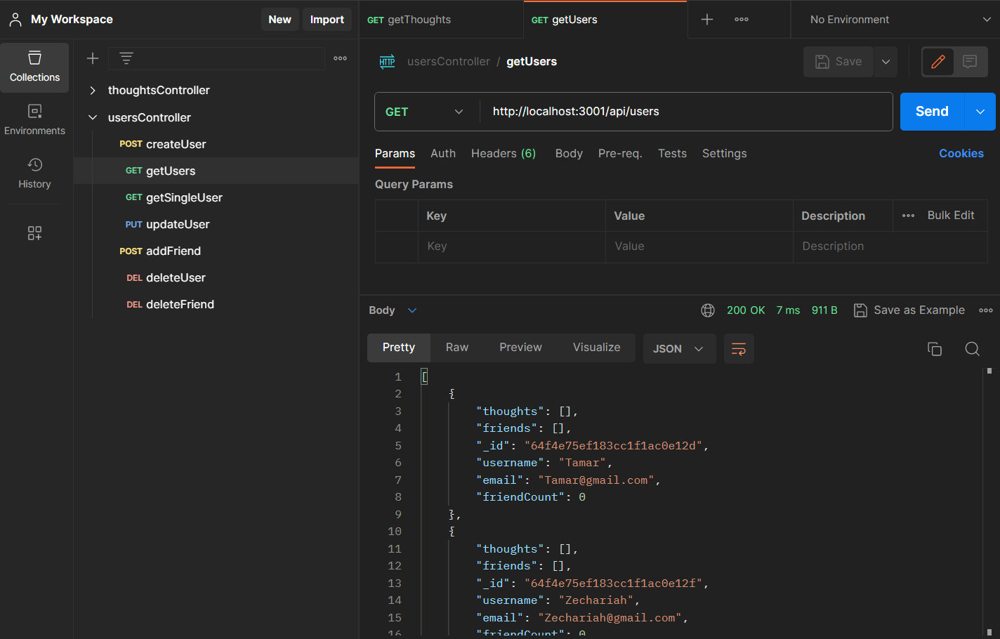
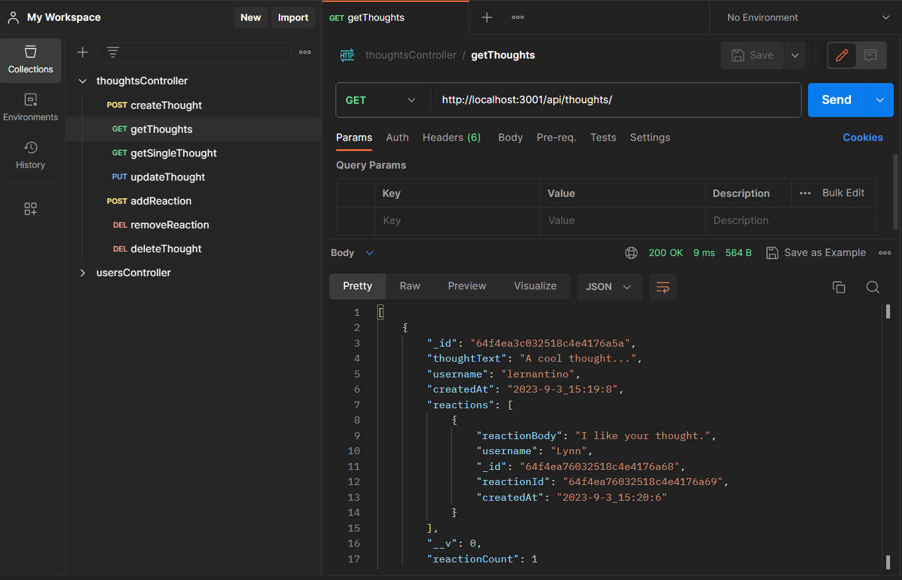

# social-network-api


Walk-through Video: https://watch.screencastify.com/v/3nrURPAwNSxY1csMRpsF
## Description

In this project, the backend and core framework has been established for a social network web application. Details pertaining to users, thoughts, and reactions are stored within a MongoDB database given its speed with large amounts of data and flexibility with unstructured data. Users have the capability to share their thoughts, react to friends’ thoughts, and create a friend list based on their demand.

## Table of Contents

* [Installation](#installation)

* [Technology](#technology)

* [Usage](#usage)

* [License](#license)

* [Contributing](#contributing)

* [Tests](#tests)

* [Questions](#questions)


## Installation

To install dependencies, run these commands:

```
npm install
```

## Technology
Technology used:
- node.js
- MongoDB database
- Mongoose ODM
- Express.js

## Usage
- Can GET all users, Get one user, POST a user, PUT a user's information, DELETE a user, POST a friend and DELETE a friend for a user in User model.



- Can GET all thoughts, Get one thought, POST a thought, PUT a thought, DELETE a thought, POST a reaction and DELETE a reaction for a thought in Thought model.


## License

      Copyright © MIT. All rights reserved. 
      
      Licensed under the MIT license.


## Contributing
To make this project better, please fork the repo and create a pull request. You can also simply open an issue with the tag "enhancement".

* Fork the Project
* Create your Feature Branch (git checkout -b feature/AmazingFeature)
* Commit your Changes (git commit -m 'Add some AmazingFeature')
* Push to the Branch (git push origin feature/AmazingFeature)
* Open a Pull Request

## Tests

To run tests, run these commands:

```
npm run test
```

## Questions
This project is contributed by [yul402](https://github.com/yul402/)

Contact infotmation: Ying.li20@outlook.com
